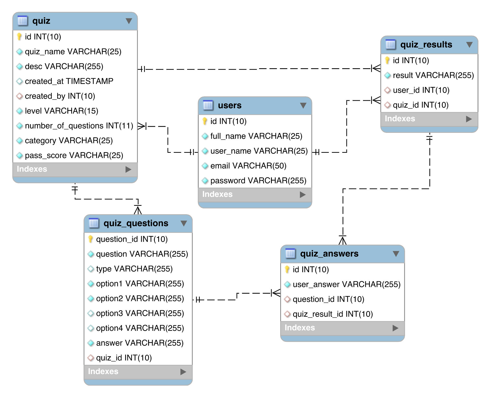

# Quiz App

This is a Web Application built on Node js and Express js with pug as templating engine in a monolithic(application is self-contained and independent) approach.

This a web application implements a decent number of features to take a quiz

-   User SignUp and Login
-   Creating a Quiz
-   Taking a Quiz
-   Checking the results with Correct Answers
-   Searching a Quiz
-   User Profiles
-   LeaderBoard for Each Quiz

This is a #gamification approach among participants to share knowledge and explore things

# Design

## Database

I used mysql as my database for the application and the database schema looks as follows



### knex js

I used [knex js](http://knexjs.org) as a query builder to interact with mysql database. like to perform fetch, insert and update (CRUD)the data in database

We can install knex as follows

```
npm install knex --save
```

In ` knexfile.js` you need to define your sql database connection details

Like the following

```
client: 'mysql',
    connection: {
      host : '127.0.0.1',
      port : 3306,
      user : 'username',
      password : 'user_password',
      database : 'database_name'
    },
    migrations: {
      tableName: 'migrations'
    }
```

# Installation

### Clone the project

```
git clone https://github.com/manisaiprasad/quiz_app.git
```

### Instaling requriments

```
cd quiz_app
npm install --save
```

It will install all the npm packages requried

Now configure the ` knexfile.js` as show above and run the migrations to create the database tables

```
knex migrate:up
```

### Running the app

```
npm start
```

Now navigate to http://localhost:3000 you should see the app running
